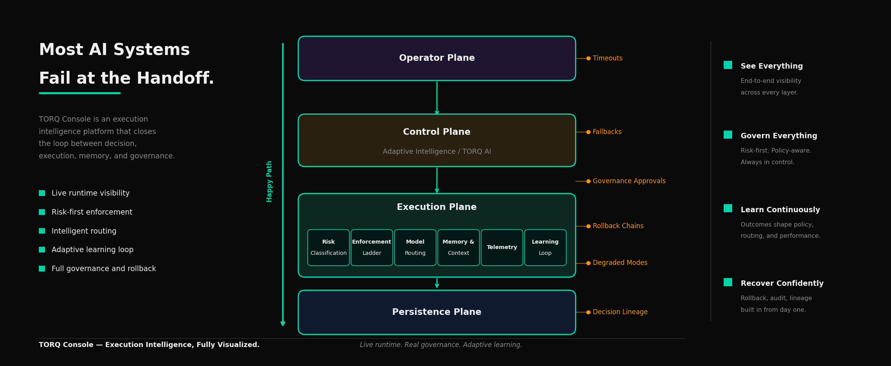

# TORQ Console Architecture

Public architecture documentation for TORQ Console — a multi-asset execution intelligence platform.

> Production source code remains private. This repository documents the system design.

---

## Four-Plane Architecture

TORQ Console is organized into four functional planes, each with a distinct role in the execution workflow:

### 1. Intelligence Plane
The decision layer. Processes market signals, evaluates thesis alignment, and generates actionable intelligence for human review.

- Signal ingestion and normalization
- Thesis-alignment scoring
- Conviction ranking and opportunity surfacing

### 2. Execution Plane
The action layer. Receives confirmed instructions from the Intelligence Plane and routes them to appropriate venues.

- Order construction and validation
- Smart order routing (SOR)
- Execution venue connectivity

### 3. Risk Plane
The control layer. Operates across both pre-trade and post-trade phases, enforcing limits and monitoring exposure.

- Pre-trade risk checks
- Real-time position and P&L monitoring
- Limit breach detection and circuit breakers

### 4. Reporting Plane
The accountability layer. Captures execution history, generates compliance-ready records, and supports post-trade analysis.

- Trade blotter and execution history
- Regulatory reporting scaffolding
- Performance attribution

---

## Architecture Diagram



---

## Design Principles

- **Separation of concerns** — each plane has a single, well-defined responsibility
- **Human-in-the-loop** — intelligence surfaces opportunities; humans confirm before execution
- **Auditability by design** — every decision and execution is logged for review
- **Asset-class agnostic** — the architecture supports equities, crypto, and alternative assets

---

## Repository Structure

```
torq-console-architecture/
├── README.md                    # This file
├── LICENSE                      # MIT License
└── diagrams/
    └── architecture-overview.png  # Four-plane architecture diagram
```

---

## Further Reading

- [TORQ Console Article Thread](https://x.com/DAssetBuzz/status/2054350904866881616)
- [Execution Intelligence Thesis](https://torqbusiness.notion.site/execution-intelligence)
- [TORQ Console Landing Page](https://torq-site-pi.vercel.app)

---

## License

MIT License — see [LICENSE](LICENSE) for details.

Public architecture documentation. Production source code remains private.
